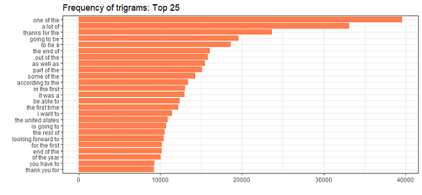
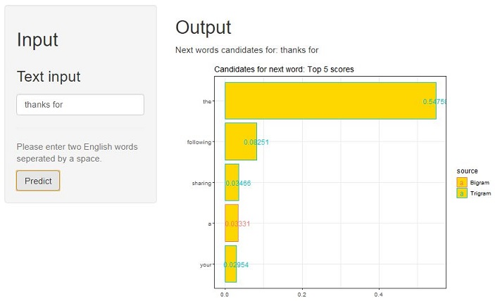

## What is this about?
The goal of this exercise was to build a predictive model of English text.
For example: if somebody types 2 words an algorithm predicts the next word.

The prediction is based on

- a text dataset consisting of nearly 5 millions lines of text. 
- an n-gram model (see [wikipedia](https://en.wikipedia.org/wiki/N-gram)) with ca 645.000 unigrams, 10 million bigrams and 30 million trigrams.
- the stupid backoff algorithm, see [literature](https://www.aclweb.org/anthology/D07-1090.pdf).

The [shiny app](https://hn317.shinyapps.io/ShinyNgram/) returns a plot showing 5 candidates for the next word with the top overall scores, indicating if prediction is drawn from trigrams, bigrams or unigrams.

## Steps for natural language processing

1. importing text dataset into R
2. creating a text corpus: combine and structure the texts to be able to access them in a uniform manner
3. cleaning: text reformatting (conversion to lower case, whitespace removal)
4. tokenziation: splitting text into unigrams (1 word), bigrams (2 words), trigrams (3 words) and creating a term-document matrix
5. calculation of scores based on relative frequencies and returning the top scores for an input

**Challenges**

- volume: the amount of text severely challenged memory and runtime performance; for the shiny app textsource was reduced to top 10 score per ngram and frequency > 1 
- algorithm: understand available algorithms and choose the best fit

## Trigram Top 25 Frequency

## Result

Development of prediction model, shiny app and presentation were done for the Data Science Capstone project  from Johns Hopkins on Coursera.

